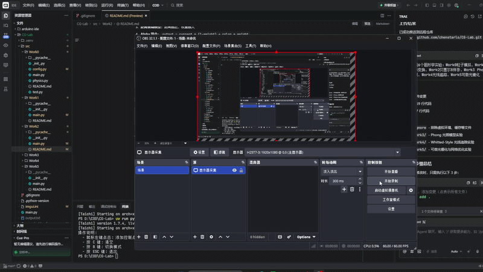

# 实验三：贝塞尔曲线与 B 样条曲线

**姓名：赵春哲 | 学号：202411998378 | 专业：人工智能**

基于 Taichi 框架的曲线绘制与交互式实验

## 实验简介

本实验实现了贝塞尔曲线和均匀三次 B 样条曲线的绘制，通过 De Casteljau 算法和矩阵形式计算曲线坐标，并使用 GPU 进行高效的光栅化渲染。实验还实现了反走样技术，使曲线边缘更加平滑。

## 技术栈

- **Taichi** >=1.7.4 - 高性能并行计算框架
- **Python** >=3.12

## 项目结构

```
src/Work2/
├── __init__.py
└── main.py        # 主程序，包含 De Casteljau 算法、B样条矩阵和反走样渲染
```

## 核心功能

### 1. De Casteljau 算法
- 递归线性插值计算贝塞尔曲线上的点
- 支持任意数量（≥2）的控制点
- 实时计算曲线上的 1001 个采样点

### 2. 均匀三次 B 样条曲线
- 使用矩阵形式计算 B 样条曲线
- 每 4 个相邻控制点构成一段曲线
- n 个控制点（n≥4）生成 n-3 段平滑拼接的曲线

### 3. 反走样渲染
- 使用 3x3 邻域像素进行距离衰减
- 基于像素中心点与几何点的距离分配权重
- Alpha 混合实现平滑边缘效果

### 4. GPU 光栅化渲染
- 使用 GPU 并行点亮像素
- 800x800 像素缓冲区
- 高效的批量绘制

### 5. 交互式控制
- 鼠标左键点击添加控制点
- 键盘 C 键清空所有控制点
- 键盘 B 键切换曲线模式（贝塞尔/B样条）
- ESC 键退出程序

### 6. 可视化元素
- 红色圆点：控制点（反走样绘制）
- 灰色线条：控制多边形（反走样绘制）
- 绿色曲线：贝塞尔曲线或 B 样条曲线（反走样绘制）

## 技术实现

### De Casteljau 算法原理

De Casteljau 算法是一种利用递归线性插值来求取贝塞尔曲线坐标的优雅算法：

1. **第一层插值**：对于给定的参数 `t`，在相邻控制点之间进行线性插值
   - `P' = (1-t) * P0 + t * P1`

2. **递归过程**：对生成的新点重复上述操作，直到只剩一个点

3. **终止条件**：当最终只剩下一个点时，这个点就是贝塞尔曲线在参数 `t` 处的坐标

### 均匀三次 B 样条曲线

使用矩阵形式计算，避免复杂的递归：

```
M = (1/6) * [
    [-1,  3, -3,  1],
    [ 3, -6,  3,  0],
    [-3,  0,  3,  0],
    [ 1,  4,  1,  0]
]

P(t) = [t³ t² t 1] @ M @ [P0 P1 P2 P3]^T
```

### 反走样算法

1. **获取精确浮点坐标**：保留亚像素级精度
2. **遍历 3x3 邻域**：考察几何点周围的像素
3. **距离衰减模型**：距离越近，权重越大
4. **Alpha 混合**：`output = current * (1-weight) + color * weight`

## 快速开始

### 安装依赖

```bash
uv sync
```

### 运行程序

```bash
uv run python -m src.Work2.main
```

### 使用说明

1. 运行程序后会弹出一个 800x800 的黑色窗口
2. **鼠标左键点击**：在画布上添加控制点
3. **贝塞尔曲线模式**：添加 2 个以上控制点后自动绘制
4. **B 样条曲线模式**：添加 4 个以上控制点后自动绘制
5. **按 B 键**：切换曲线模式（贝塞尔/B样条）
6. **按 C 键**：清空所有控制点，重置画布
7. **按 ESC 键**：退出程序

## 交互演示

### 添加控制点

通过鼠标左键在画布上点击以添加控制点。每次点击后，屏幕应记录并渲染出相应的控制点（红色圆点）和控制多边形（灰色线段）。

### 曲线模式切换

按 **B 键** 在贝塞尔曲线和 B 样条曲线之间切换：

- **贝塞尔曲线**：曲线穿过第一个和最后一个控制点，全局控制
- **B 样条曲线**：曲线不穿过控制点，局部控制

### 清空画布

按 **C 键** 清空所有控制点，重新开始绘制。

## 性能优化技巧

### 1. 批量传输（Batching）

在现代图形学编程中，CPU 和 GPU 是物理分离的，它们之间通过 PCIe 总线通信。如果在 Python（CPU）的 for 循环里，每次算出一点就去修改 Taichi 的 GPU Field（如 `pixels[x, y] = 颜色`），海量的跨界通信将使帧率大幅降低，造成卡顿。

**正确的做法**：在 CPU 里把 1000 个点的坐标全算好，装进一个数组，一次性发送给 GPU，然后让 GPU 并行地把这 1000 个像素点亮。

### 2. 显存预分配（Object Pool）

现代高性能渲染管线（如 Metal/Vulkan）极其反感在主循环中"动态申请内存"。绘制辅助线时，最好不要传给它长度忽大忽小的数组，而是预先分配一个固定大小的显存池。

本程序预先分配了：
- `pixels`: 800x800 像素缓冲区
- `curve_points_field`: 1001 个曲线点
- `gui_points`: 100 个控制点

## 技术亮点

1. **De Casteljau 算法**：优雅的递归线性插值
2. **B 样条矩阵形式**：简化的分段多项式计算
3. **反走样渲染**：基于距离衰减的平滑边缘
4. **GPU 并行计算**：利用 `@ti.kernel` 装饰器实现高效像素绘制
5. **批量传输优化**：减少 CPU-GPU 通信开销
6. **显存预分配**：避免动态内存申请，提高渲染性能
7. **模式切换**：贝塞尔曲线与 B 样条曲线的直观对比

## 数学原理

### 贝塞尔曲线

贝塞尔曲线是由一组"控制点"决定的平滑曲线。为了求出曲线上的具体坐标，我们引入一个参数 `t ∈ [0, 1]`。当 `t` 从 0 连续变化到 1 时，求出的所有点连在一起就构成了整条曲线。

### B 样条曲线

B 样条曲线通过引入节点向量和分段多项式基函数，实现了"局部控制"：

```
P(t) = Σ P_i * N_{i,p}(t)
```

其中 `N_{i,p}(t)` 是 B 样条基函数，`p` 是曲线阶数。

### 贝塞尔曲线 vs B 样条曲线

| 特性 | 贝塞尔曲线 | B 样条曲线 |
|------|-----------|-----------|
| 控制点影响 | 全局 | 局部 |
| 曲线通过控制点 | 首尾控制点 | 不通过 |
| 曲线阶数 | n-1（n个控制点） | 固定（通常为3） |
| 数值稳定性 | 高阶时不稳定 | 始终稳定 |

## 实验现象观察

### 1. 反走样效果
- **开启反走样**：曲线边缘平滑，无明显锯齿
- **关闭反走样**：曲线边缘呈现阶梯状

### 2. 贝塞尔曲线特性
- 曲线穿过第一个和最后一个控制点
- 移动任意控制点会影响整条曲线
- 控制点越多，曲线阶数越高，计算越慢

### 3. B 样条曲线特性
- 曲线不穿过任何控制点
- 移动一个控制点只影响相邻的几段曲线
- 可无限增加控制点而不增加曲线阶数

## 预期效果

程序运行后，会在窗口中显示一个 800x800 的黑色画布。通过鼠标左键点击添加控制点，根据当前模式自动生成曲线。

### 视觉效果

- **黑色背景**：代表空白画布
- **红色圆点**：表示用户添加的控制点（反走样绘制）
- **灰色线段**：连接控制点形成的控制多边形（反走样绘制）
- **绿色曲线**：贝塞尔曲线或 B 样条曲线（反走样绘制）

这种视觉反馈可以帮助用户直观理解控制点与曲线之间的关系，以及贝塞尔曲线和 B 样条曲线的差异。

## 效果展示



