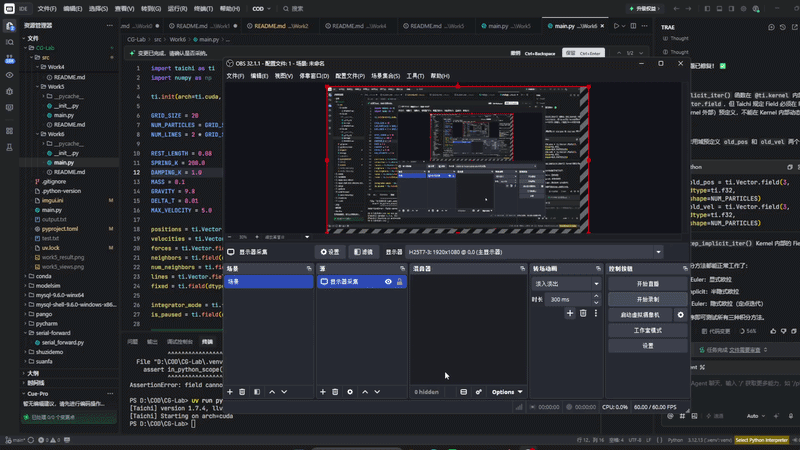
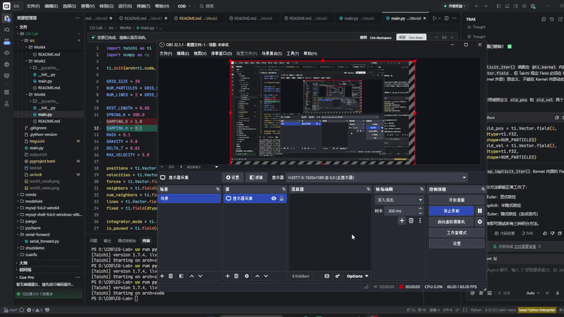

# 实验七：质点-弹簧模型与数值积分

**姓名：赵春哲 | 学号：202411998378 | 专业：人工智能**

## 实验目标

- 掌握动态场景渲染：了解并使用 Taichi 框架构建 3D 场景，学习使用 Taichi GGUI 编写交互面板。
- 理解质点-弹簧模型：掌握基于物理的弹力与阻尼力计算方法，并处理数值爆炸问题（如速度钳制）。
- 对比数值积分方法：独立编写并比较三种常见的数值积分求解器（显式欧拉、半隐式欧拉、隐式欧拉），观察并理解它们在物理模拟中的稳定性差异。
- 理解 GPU 编程基础：学习 Taichi 中的 ti.kernel 与 ti.func，了解并行计算中的状态同步与 Kernel 启动开销优化。

## 实验原理

### 2.1 质点-弹簧模型 (Mass-Spring Model)

质点-弹簧系统是计算机图形学中最经典的变形体模拟方法之一。我们将布料离散化为网格状的质点集合，质点之间通过弹簧相连（本实验基础要求实现结构弹簧）。

根据胡克定律 (Hooke's Law)，两个质点 $$a$$ 和 $$b$$ 之间的弹力公式为：

$$f_{a} = -k_{s} (|x_a - x_b| - l) \frac{x_a - x_b}{|x_a - x_b|}$$

其中 $$k_s$$ 为弹簧的劲度系数，$$l$$ 为弹簧的原长，$$x$$ 为质点位置。同时，为了防止系统能量无限增加导致发散，我们需要引入阻尼力 (Damping force)：

$$f_{d} = -k_{d} v_{a}$$

### 2.2 数值积分方法 (Numerical Integration)

根据牛顿第二定律，质点的加速度 $$a = F/m$$。在离散的时间步 $$\Delta t$$ 内，我们需要通过数值积分更新质点的速度 $$v$$ 和位置 $$x$$。

- **显式欧拉 (Explicit Euler)**：完全使用当前时刻的状态来预测下一时刻。
  $$x_{t+1} = x_{t} + v_{t} \Delta t$$
  $$v_{t+1} = v_{t} + a_{t} \Delta t$$

- **半隐式欧拉 (Semi-Implicit / Symplectic Euler)**：先更新速度，然后使用更新后的速度来更新位置。
  $$v_{t+1} = v_{t} + a_{t} \Delta t$$
  $$x_{t+1} = x_{t} + v_{t+1} \Delta t$$

- **隐式欧拉 (Implicit / Backward Euler)**：使用未来时刻的状态来计算受力（本实验使用定点迭代法近似求解）。
  $$v_{t+1} = v_{t} + a_{t+1} \Delta t$$
  $$x_{t+1} = x_{t} + v_{t+1} \Delta t$$

## 实现细节

### 3.1 场景初始化

- 定义布料的网格大小为 20x20，共 400 个质点
- 初始化质点的位置、速度、受力和弹簧的拓扑结构
- 使用多个 `@ti.kernel` 保证 GPU 计算状态的同步：
  - `init_positions()`：初始化质点位置和固定点
  - `init_springs()`：初始化弹簧连接关系

### 3.2 力学计算与防爆处理

- `compute_forces_on()`：计算重力、阻尼力，并累加弹簧力（使用 `ti.atomic_add` 避免多线程写入冲突）
- `clamp_velocity()`：限制质点的最大速度，防止数值爆炸
- 使用 `@ti.func` 声明，编译时强制内联，减少 GPU 函数调用开销

### 3.3 积分求解器实现

- `step_explicit()`：显式欧拉积分
- `step_semi_implicit()`：半隐式欧拉积分
- `step_implicit_iter()`：隐式欧拉积分（使用 3 次定点迭代）

### 3.4 渲染与 GGUI 交互

- 使用 Taichi 的 `ti.ui.Window` 构建 3D 场景
- `window.GUI` 控制面板功能：
  - 按钮切换三种积分方法（显式欧拉、半隐式欧拉、隐式欧拉）
  - 暂停/继续按钮
  - 重置按钮

## 参数设置

| 参数 | 值 | 说明 |
|------|-----|------|
| GRID_SIZE | 20 | 布料网格大小 |
| REST_LENGTH | 0.08 | 弹簧原长 |
| SPRING_K | 200.0 | 弹簧劲度系数 |
| DAMPING_K | 0.5 | 阻尼系数 |
| MASS | 0.1 | 质点质量 |
| GRAVITY | 9.8 | 重力加速度 |
| DELTA_T | 0.01 | 时间步长 |
| MAX_VELOCITY | 5.0 | 最大速度（防爆） |

## 操作说明

- **鼠标右键 + 拖动**：旋转视角
- **控制面板**：
  - 显式欧拉：最简单但不稳定，大时间步下容易发散
  - 半隐式欧拉：稳定且能量守恒，推荐使用
  - 隐式欧拉：最稳定，可处理大时间步

## 预期效果

程序运行后，会在窗口中显示一个 3D 场景，包含一块悬挂的布料。布料会在重力作用下自然下垂，模拟真实的物理效果。右侧有控制面板，可以切换不同的数值积分方法。

### 视觉效果

- **蓝色布料**：由 20x20 网格质点组成，呈现蓝色半透明效果
- **固定点**：布料顶部的两个角被固定，模拟悬挂效果
- **重力效果**：布料自然下垂并摆动

### 阻尼效果对比

- **阻尼系数 1.0**：阻尼很大，布料快速稳定，摆动幅度小
- **阻尼系数 0.1**：阻尼很小，布料摆动幅度大，需要较长时间才能稳定

## 交互演示

### 积分方法切换

通过控制面板的三个按钮，可以切换不同的数值积分方法：

1. **显式欧拉**：
   - 最简单的积分方法
   - 大时间步下容易发散（数值爆炸）
   - 适合理解基本原理

2. **半隐式欧拉**：
   - 先更新速度，再用新速度更新位置
   - 稳定且近似能量守恒
   - 推荐使用的方法

3. **隐式欧拉**：
   - 使用未来时刻的状态计算受力
   - 最稳定，可处理大时间步
   - 使用定点迭代法近似求解

### 阻尼效果观察

- **高阻尼 (Kd=1.0)**：布料快速停止摆动，呈现"僵硬"效果
- **低阻尼 (Kd=0.1)**：布料持续摆动，呈现"柔软"效果

### 控制面板操作

- **暂停按钮**：暂停物理模拟，布料保持当前状态
- **重置按钮**：重置布料到初始状态，重新开始模拟

## 效果展示

### 阻尼系数 1.0 演示

### 阻尼系数 0.1 演示

